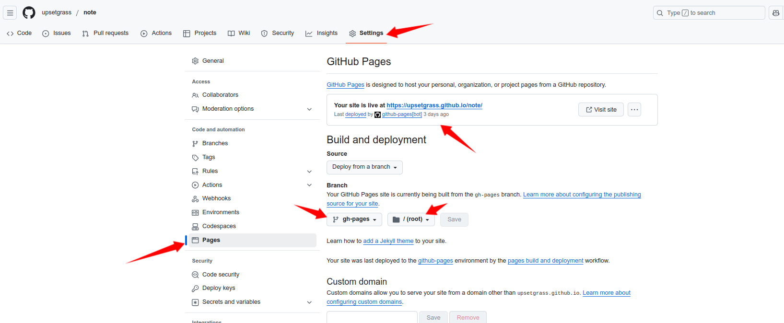

# github操作

需要在github仓库的settings里面的Pages项去修改这些内容  

  

这里your site is live at https://upsetgrass.github.io/note/ 就是github给我们的文档分配的地址  

格式为：https://<用户名/组织名>.github.io/<仓库名>  

我们在Readme.md中就可以以  \[文档](https://upsetgrass.github.io/note/)    这种形式超链接到我们写的书籍  

下面Branch中设置gh-pages/root的前提是需要先把.github/workflows/mdbook.yml git到该仓库，此时github就会自动出现gh-pages分支，用于处理Github Pages，也就是会把这个分支作为书籍的源文件  

这里需要注意的是，我们之前在.github/workflows/mdbook的生成/book的操作是在主分支，但是生成的结果放在了gh-pages分支，所以是以gh-pages分支作为源文件  