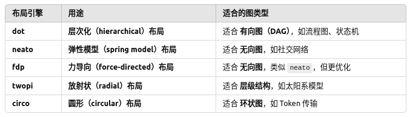
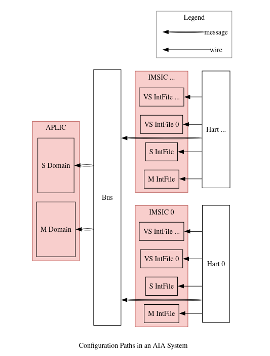

# 插图
有多种方式生成我们所需要的图，1、graphviz 2、drawio  

第一种方式是以代码的形式存储，第二种方式是以图形化、交互式的方式进行，.drawio->.svg  

简要针对第一种方式进行讲解  
Graphviz是一个底层图形可视软件，通过命令行和编程接口来生成图表，通过解析DOT语言，自动布局绘制图，而直接写DOT语言会比较困难，所以有人将DOT接口进行优化封装，即pydot，我们通过执行python脚本，自动生成.dot，又由Graphviz将.dot解析成.svg等图片格式  

所以我们只需要专注于pydot，pydot中有三个主要的类node、Subgraph、Graph  
1、node是pydot最基本的元素，表示一个独立的实体，其中不能包含其他的节点，需要加入到Graph/SubGraph中，否则不会显示在最终的图中  
2、Subgraph子图是一组节点的集合，其本身不是节点，可以包含多个 Node，并且可以用边连接节点  
3、Graph是整个图，是最终的可视化对象。是最高级的容器，可以包含：节点、子图、边，只有Graph、DiGraph对象可以被write_png()  write_svg()输出为最终图像  

那么在pydot中就是创建这些类，然后将node、Subgraph、Graph连接起来就构成了图，然后根据不同的需求，用不同的布局引擎来使用不同的图形排版，如下所示  
`dot -Tpng example.dot -o example_dot.png`  
`fdp -Tpng example.dot -o example_fdp.png`  
  

从理解层面，排除掉边，就可以把Graph理解为根，Subgraph理解为非叶子节点，node就是叶子节点  

```python
# Dot就是主图，Edge用于连线，Node就是节点，Subgraph就是子图
from pydot import Dot, Edge, Node, Subgraph

# 创建一个空的有向图
graph = pydot.Dot(graph_type="digraph")

# 创建节点，节点在DOT语言中的唯一ID为msi_device_0，其中文字显示为MSI Device0
msi = Node("msi_device_0", label="MSI Device0")

# 创建一个子图
subgraph = pydot.Subgraph("cluster_1")
```

```python
# main.py
from arch_common import *

###############################################################################
# Graph
###############################################################################
graph = AIADot(label="Configuration Paths in an AIA System", rankdir="RL")
configure = graph.main

###############################################################################
# Nodes and Subgraphs
###############################################################################
configure.add_subgraph(aplic)
configure.add_node(bus_network)
for imsic_hart in imsic_harts:
  configure.add_subgraph(imsic_hart)

###############################################################################
# Edges
###############################################################################
for domain in aplic.domains:
  configure.add_edge(MessageEdge(bus_network, domain))
for imsic_hart in imsic_harts:
  imsic = imsic_hart.imsic
  hart = imsic_hart.hart
  for intFile in imsic.intFiles:
    configure.add_edge(WireEdge(hart, intFile))
    configure.add_edge(Edge(intFile, bus_network, color="transparent"))
  configure.add_edge(MessageEdge(hart, bus_network))

###############################################################################
# Output
###############################################################################
graph.write(__file__.replace("_dot.py", "_py.dot"))
```

```python
# arch_common.py
from pydot import Dot, Edge, Node, Subgraph

###############################################################################
# Nodes and Subgraphs
###############################################################################
msi_devices = [
  Node("msi_device_0", label="MSI Device 0"),
  Node("msi_device_1", label="MSI Device 1"),
  Node("msi_device__", label="MSI Device ..."),
]

class APLIC(Subgraph):
  def __init__(self):
    Subgraph.__init__(self, "aplic", label="APLIC", cluster=True,
      style='filled', bgcolor="#F8CECC", pencolor="#B85450",
    )
    self.domains = [
      Node("m_domain", label="M Domain", height=1.5),
      Node("s_domain", label="S Domain", height=1.5),
    ]
    for domain in self.domains:
      self.add_node(domain)
aplic = APLIC()

wired_devices = [
  Node("wired_device_0", label="Wired Device 0"),
  Node("wired_device_1", label="Wired Device 1"),
  Node("wired_device__", label="Wired Device ..."),
]

bus_network = Node("bus_network", label="Bus", height=7)

class IMSICHart(Subgraph):
  def __init__(self, id, suffix):
    Subgraph.__init__(self, f"imsic_hart_{suffix}", label="", cluster=True,
      pencolor="transparent",
    )
    self.imsic = self.IMSIC(id, suffix)
    self.add_subgraph(self.imsic)
    self.hart = Node(f"hart_{suffix}", label=f"Hart {id}", height=3.2)
    self.add_node(self.hart)
    
  class IMSIC(Subgraph):
    def __init__(self, id, suffix):
      Subgraph.__init__(self, f"imsic_{suffix}", label=f"IMSIC {id}", cluster=True,
        style="filled", bgcolor="#F8CECC", pencolor="#B85450",
      )
      self.intFiles = [
        Node(f"imsic_{suffix}_mint_file", label="M IntFile"),
        Node(f"imsic_{suffix}_sint_file", label="S IntFile"),
      ]
      self.intFiles += [
        Node(f"imsic_{suffix}_vsint_file_0", label=f"VS IntFile 0"),
        Node(f"imsic_{suffix}_vsint_file__", label=f"VS IntFile ..."),
      ]
      for intFile in self.intFiles:
        self.add_node(intFile)

imsic_harts = [IMSICHart(0, 0), IMSICHart("...", "_")]

###############################################################################
# Edges
###############################################################################
class MessageEdge(Edge):
  def __init__(self, src, dst, obj_dict=None, **attrs):
    Edge.__init__(self, src, dst, obj_dict, **attrs, color='"black:invis:black"')
class WireEdge(Edge):
  def __init__(self, src, dst, obj_dict=None, **attrs):
    Edge.__init__(self, src, dst, obj_dict, **attrs)

###############################################################################
# Graph
###############################################################################
class AIADot(Dot):
  class Legend(Subgraph):
    def __init__(self):
      Subgraph.__init__(self, "legend", label="Legend", cluster=True, pencolor="gray")
    def add_edge_legend(self, EdgeClass, label):
      src = Node(f"legend_${label}_edge_src", shape="plain", label=label)
      self.add_node(src)
      dst = Node(f"legend_${label}_edge_dst", shape="plain", label=" ")
      self.add_node(dst)
      self.add_edge(EdgeClass(src, dst))

  def __init__(self, *argsl, **argsd):
    Dot.__init__(self, *argsl, **argsd,
      splines="ortho",
      bgcolor="transparent",
    )
    self.main = Subgraph("main", label="", cluster=True, pencolor="transparent")
    self.main.set_node_defaults(shape="box")
    self.add_subgraph(self.main)
    self.legend = self.Legend()
    self.add_subgraph(self.legend)
    self.legend.add_edge_legend(WireEdge, "wire")
    self.legend.add_edge_legend(MessageEdge, "message")

```
此时python main.py即可生成.dot，然后用前面说的布局引擎即可生成图片，上例生成的图片如下图所示  
  