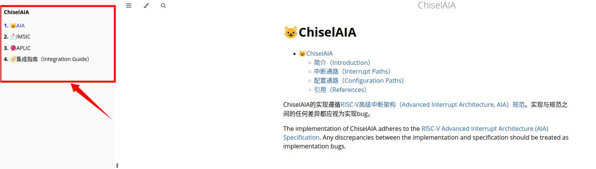

# src源文件

SUMMARY.md是书籍的目录  
```markdown
# Summary

# ChiselAIA

* [😺AIA](./index.md)
* [📩IMSIC](./imsic.md)
* [🧶APLIC](./aplic.md)
* [🧭集成指南（Integration Guide）](./integration.md)
```
mdbook会分析SUMMARY.md中指向的.md，只有加在了SUMMARY.md中的章节，才会生成对应的html最终在书籍中才能看到对应的章节，下图框出部分就是SUMMARY.md的内容展示，右侧就是index.md的内容，index.md会作为进入页（初始页）  
  
对于.md中需要使用到的图片，需要存放到src/images下，并在.md中以\!\[](./images/XXX.svg)的形式引用进来  
ps：\[]() - 超链接，\ - 图片插入  
